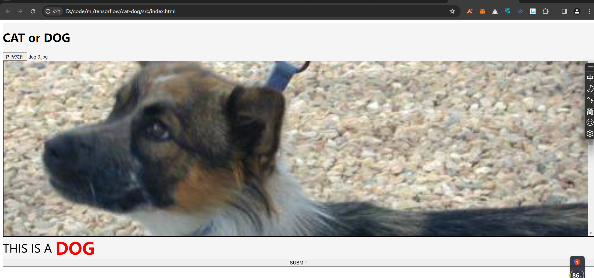
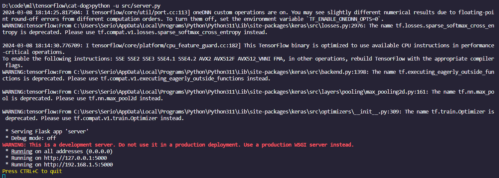

# 前后端分离的猫狗分类

## 前言

这个项目是我的一个练手作品，使用的是 CNN 架构中的 VGG-like 模型，也就是一种轻量化的 VGG——只有三层卷积。

在我完成这个仓库的前几天，我试着去投递一些大企业的前端+计算机视觉算法岗位，但是很不幸的是我的能力没有达到他们的要求，我感到非常沮丧。

有朋友告诉我，他们可能更想招的是做视觉算法转岗前端的硕士，而不是一个前端跨行做视觉算法的本科生。

很感谢朋友的劝勉，但至少两三年内，我应该不会再投递相关的岗位了，毕竟自己还是太差劲了，现在的技术水平可能还不如发达地区的小学生呢，别人哪敢随便让我一个半路出家的上生产环境呀。

不过我并不打算就此放弃，我相信 AI 一定是未来。

我失败了这么多年，这一次，我一定要牢牢地把未来抓在我手里。

## 关于 VGG

> 这里是大模型的介绍

VGG（Visual Geometry Group）模型是由牛津大学视觉几何组（Visual Geometry Group）的Karen Simonyan和Andrew Zisserman在2014年提出的深度卷积神经网络（CNN）架构。VGG模型因其简洁而深的结构闻名，在当年的ImageNet大规模视觉识别挑战赛（ILSVRC）中取得了优异的成绩，尤其是在**图像分类**任务上，虽未夺冠，但其在迁移学习方面的表现获得了广泛的认可。

VGG模型的主要特点包括：

- **(在那个年代的)深度网络设计**：VGG模型引入了深度的重要性，通过不断叠加卷积层和池化层构建深层网络，典型如VGG16和VGG19，分别有16层和19层（不包括输入层和输出层），加深网络层数可以捕获更复杂的图像特征。

- **统一的滤波器尺寸**：VGG网络中所有的卷积层都采用小尺寸的3x3卷积核，并且使用堆叠的连续几个3x3卷积层代替大尺寸的卷积核，这样既能保持感受野不变又能降低参数量和计算复杂度。

- **池化层**：网络中采用的是最大池化层，窗口大小为2x2，步长为2，用于下采样特征图。

- **全连接层**：在卷积层之后，VGG网络使用了几个全连接层来完成分类任务，最后是一个softmax层做输出。

- **参数量**：尽管结构简洁，但VGG模型由于其深度和多层卷积，参数量相对较大。例如VGG16模型含有约138M个参数。

VGG模型的成功之处在于证明了通过增加网络的深度可以显著提高图像识别的性能，并且它的结构也被广泛应用于后续的深度学习模型设计中作为基础模块和灵感来源。尽管后来出现的更先进的网络结构如ResNet、DenseNet等在参数效率和训练难度方面有所优化，但VGG模型至今仍是深度学习领域中图像识别的经典之作，并且在很多实际场景中作为预训练模型进行迁移学习。

## 文件结构

文件结构非常简单：

- `models/*`: 训练好的模型，其文件名形如 `tra(x)-val(y).keras`, 其中x代表训练集上的准确率，y代表测试集上的准确率。

- `src/*`: 源码文件，包含前端代码、模型训练代码、服务器代码。


## 启动项目

- 前端：`src/index.html` 双击打开即可。



- 服务端：`src/server.py`，使用如下命令即可启动：

```sh
cd web-cat-dog-classification # 进入项目根目录
python -u src/server.py
```

项目成功启动则可看到如下信息：




## LICENSE

MIT